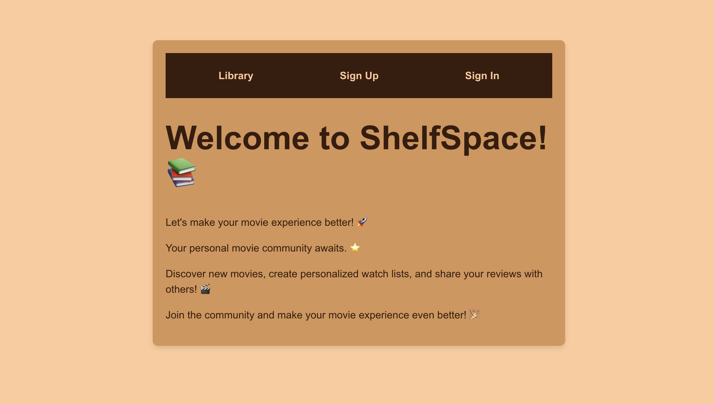

# ShelfSpace

## Home Page

## Table of Contents

- [Screenshot/Logo](#Home-Page)
- [Getting Started](#getting-started)
  - [Deployed Application](#deployed-application)
  - [Planning Materials](#planning-materials)
  - [Back-End Repository](#back-end-repository)
- [Attributions](#attributions)
- [Technologies Used](#technologies-used)
- [Next Steps](#next-steps)
- [Features](#features)
- [Contributing](#contributing)

## Getting Started

### Deployed Application

The deployed application can be found here: [ShelfSpace](https://shelfspace-client.netlify.app/)

### Planning Materials

Check out our User Stories, Stretch Goals, Entity Relationship diagrams and wireframes: [MERN Stack Trello](https://trello.com/b/ot9apBMA/mern-stack-app)

You can also view our Agile planning board at the following URL: [Agile board](https://trello.com/b/UvfdEwWy/shelfspaceslsp)

### Back-End Repository

The server repository can be located here: [Server](https://github.com/willbryanta/ShelfSpace-server)

## Attributions

- [Resource 1](https://link-to-resource1.com): TBD

## Technologies Used

- **MongoDB** - Database for storing data
- **Express.js** - Server and authentication
- **React** - Front-end library
- **Node.js** - Server environment
- **JavaScript**

## Next Steps

Planned enhancements for future development (Stretch Goals):

- Extend the types of content the platform handles, and be able to review these types of content - such as:
  - Books
  - Podcasts
  - Magazines
- Create the functionality for a user to organise content they are consuming into three categories:
  - "I will consume"
  - "I am currently consuming"
  - "I have consumed"
- Integrate an AI model to provide recommendations based on simple prompts so that users can consume relatable content quickly

## Features

- User authentication using JWT,
- CRUD functionality for content
- Keep adding onto this....

## Contributing

Contributions are welcome! Please follow these steps:

1. Fork the repository.
2. Create a new branch
3. Commit your changes
4. Push the branch
5. Open a Pull Request.
